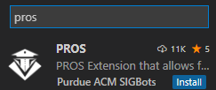
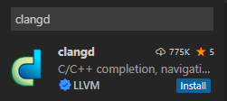
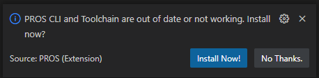
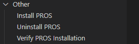
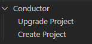

# How to setup

Here are some step by step instructions on how to install and use pros with all its features.

## Simple and straightforward download for your personal computer (Windows)

1. Install [VSCode](https://code.visualstudio.com/download)
2. Install [git](https://git-scm.com/downloads), don't forget to add git to the PATH in the checkbox (selecting all users is preferable.)
3. Install [python (latest version)](https://www.python.org/downloads/), also dont forget to add it to your PATH (selecting all users is preferable)
4. Install [mingw](https://sourceforge.net/projects/mingw/) (selecting all users is preferable)
5. Download the necessary extensions for making a robotics project in VSCode:

    

    

6. Install the PROS CLI AND toolchain

    

7. Verify PROS is installed (under the PROS tab in your VSCode)

    

8. Create a New Project

    

    - Place in the directory in which you wanted your project to be stored
    - Select v5 for the PROS library
    - Select the latest version for the PROS version

9. 
10. Publish to [github]() (<-- click here if you don't know that much about git)