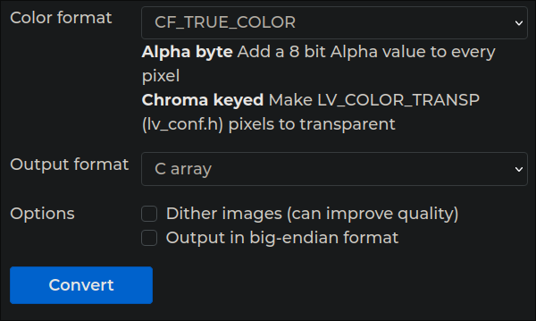

# Display.hpp

## Namespaces

So namespaces in c++ are just holders of functions, variables, and types.

Display.hpp uses the Display namespace to hold all of its tools.

To use the namespace in a different file you must first include the file.

```cpp
#include "/location/to/Display.hpp"
```

Then, as an example:

```cpp
Display::btnSetToggled(btn, true);
```

Is a way to use the Display namespace in your code, however a different way and in my personal opinion easier way to do this is by using the

```cpp
using namespace Display;
.
.
.
btnSetToggled(btn, true);
```

## disp_obj_align

 ```cpp
 enum disp_obj_align {
    DISP_LEFT,
    DISP_CENTER,
    DISP_RIGHT
};
```

This is an enum which is just like a state of variable that is declared here so when you use something like

```cpp
disp_obj_align align = DISP_LEFT;
```

This will be used to set the alignment for creating new labels and new buttons. I made it so that when you use the createLabel and createButton functions you can only decide on where the object is aligned on the screen. Pretty much everytime you use them you place the object below the previous object and you can set its alignment in the align parameter.

## lv_img_disp()

```cpp
static inline lv_obj_t* lv_img_disp(const lv_img_dsc_t* cArr, lv_align_t align = LV_ALIGN_IN_TOP_LEFT, short x = 0, short y = 0)

```

This function is used to put an image

### Some changes you need to make to lvgl

So for you to be able to use images at all in PROS you need to make some edits to lv_conf.h, one is just to allow you to use images

#### lv_conf.h

```diff
@@ +197, 1 @@
    /*Image (dependencies: lv_label*/
    #define USE_LV_IMG 1
    #if USE_LV_IMG != 0
    #  define LV_IMG_CF_INDEXED 1
    #  define LV_IMG_CF_ALPHA 1
+   #  define LV_USE_IMG
    #endif
```

and the other is one of their variables that was removed for some reason (idk maybe allowing high-schoolers to put images on the screen is not a good idea :p)

#### lv_conf.h (cont...)

```diff
@@ 109, 1 @@
    #define LV_ATTRIBUTE_TASK_HANDLER
    #define LV_ATTRIBUTE_MEM_ALIGN
+   #define LV_ATTRIBUTE_LARGE_CONST
    #define LV_COMPILER_VLA_SUPPORTED 1
    #define LV_COMPILER_NON_CONST_INIT_SUPPORTED 1
```

### How to use

To use it you first need to declare the image, to first declare the image you need to have it stored somewhere, you dont need it included or anything, you just need the C Array somewhere. I usually keep mine in a data folder under src. Pretty much if you have a C Array with the name normal.c you can just declare it with

```cpp
LV_IMG_DECLARE(normal);
```

After that you use lv_img_disp() with the desired input

```cpp
lv_img_disp(&normal, LV_ALIGN_IN_TOP_LEFT, 0, 0);
```

### cArr

This is the C Array of the picture given by reference

#### How to make a C array with a photo?

(do keep in mind the robot v5 brain resolution is only 480x272)

1. Use [this link](https://lvgl.io/tools/imageconverter) to convert any image to a C array
2. Configure your C Array like this

    

    **If you got a png with a transparent background, use the CF_TRUE_COLOR_ALPHA**

3. We are gonna make some modifications to it, make these modifications in notepad since VSCode can't take in all the data the given modfications are just an example, just follow the format.

```diff
@@ -1, 3 + 1, 5@@
-   #ifdef __has_include
-       #if __has_include("lvgl.h")
-           #ifndef LV_LVGL_H_INCLUDE_SIMPLE
-               #define LV_LVGL_H_INCLUDE_SIMPLE
-           #endif
-       #endif
-   #endif
-
-   #if defined(LV_LVGL_H_INCLUDE_SIMPLE)
-       #include "lvgl.h"
-   #else
-       #include "lvgl/lvgl.h"
-   #endif
+   #if defined(LV_LVGL_H_INCLUDE_SIMPLE)
+   #include "lvgl.h"
+   #else
+   #include "../include/display/lvgl.h"
+   #endif
```

```diff
@@ -1467,9 +1467,1 @@
-   const lv_img_dsc_t alpha = {
-   .header.cf = LV_IMG_CF_TRUE_COLOR_ALPHA,
-   .header.always_zero = 0,
-   .header.reserved = 0,
-   .header.w = 480,
-   .header.h = 360,
-   .data_size = 172800 * LV_IMG_PX_SIZE_ALPHA_BYTE,
-   .data = alpha_map,
-   };
+   const lv_img_dsc_t alpha = {{LV_IMG_CF_TRUE_COLOR_ALPHA,0,0,480,360},172800 * LV_IMG_PX_SIZE_ALPHA_BYTE,alpha_map};
```

After all of that you can place the C Array under the src/data folder

### LV_ALIGN

[This link](https://docs.lvgl.io/latest/en/html/widgets/obj.html#alignment) gives you a good breakdown of how the LV_ALIGN works

### x,y

Where the top left of the image will be.

## createLabel()

```cpp
static inline lv_obj_t* createLabel(lv_obj_t* parent, disp_obj_align align, lv_coord_t width, lv_coord_t height, const char* title,
    lv_color_t bgCol = LV_COLOR_BLACK, lv_opa_t opa = LV_OPA_0, lv_color_t textColor = LV_COLOR_WHITE, lv_style_t* copy = &lv_style_plain)
```

This function creates a label (TextBox)

### label Usage

```cpp
lv_obj_t* label = createLabel(lv_scr_act(), DISP_CENTER, 150, 40, "e");
```

all is self explainable here so no need to explain how it works (I hope)

## createBtn()

```cpp
 static inline lv_obj_t* createBtn(lv_obj_t* parent, disp_obj_align align, lv_coord_t width, lv_coord_t height, const char* title, 
        lv_color_t rel, lv_color_t tglRel, lv_style_t* copy = &lv_style_plain, lv_color_t textColor = LV_COLOR_WHITE)
```

### btn Usage

```cpp
bool game = false;
inline lv_res_t sports(lv_obj_t * btn)
{
    game = !game;
    btnSetToggled(btn, game);
    return LV_RES_OK;
}

lv_obg_t* btn - createBtn(lv_scr_act(), DISP_CENTER, 150, 40, "a",  LV_COLOR_MAKE(0, 100, 0), LV_COLOR_MAKE(0, 125, 0));

lv_btn_set_action(btn, LV_BTN_ACTION_CLICK, sports);
```

#### LV_COLOR_MAKE()

LV_COLOR_MAKE() creates a color in the format of BGR (Blue, Green, Red)

#### The function

The function must be structured like with ```inline lv_res_t sports(lv_obj_t * btn)``` at the start and it must return LV_RES_OK;

To set the function use ```lv_btn_set_action(btn, LV_BTN_ACTION_CLICK, sports);```
