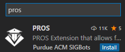
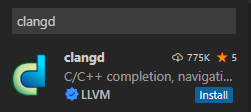
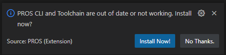
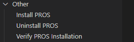
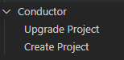

# How to setup

Here are some step by step instructions on how to install and use pros with all its features.

## Simple and straightforward download for your personal computer (Windows)

1. Install [VSCode](https://code.visualstudio.com/download)
2. Install [git](https://git-scm.com/downloads), don't forget to add git to the PATH in the checkbox (selecting all users is preferable.)
3. Download the necessary extensions for making a robotics project in VSCode:

    

    

4. Install the PROS CLI AND toolchain

    

5. Verify PROS is installed (under the PROS tab in your VSCode)

    

6. Create a New Project

    

    - Place in the directory in which you wanted your project to be stored
    - Select v5 for the PROS library
    - Select the latest version for the PROS version

7. Publish to github
8. Clone this repository and use the tools provided to go fast
